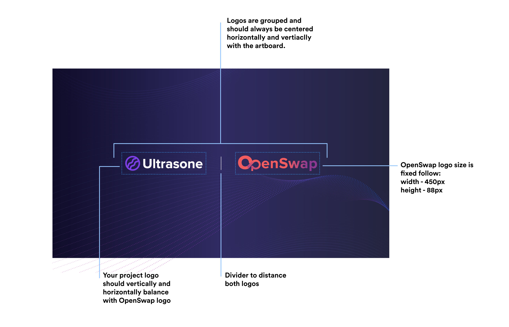
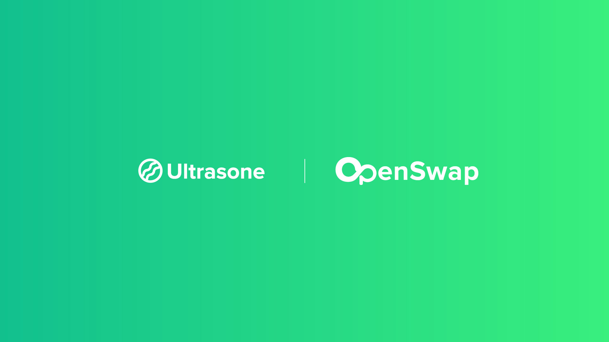

# Brand Guidelines

### About the banners

To keep consistency across publications, OpenSwap branded banners almost always follow the same layout.

**Banner guidelines**

### **Creating your own banner**

In order to create your own banner, we put together a series of templates that you can download or use.

.jpg>)

**Adobe Illustrator file**

If you or your team uses Adobe Illustrator, this template will help you create the banner. The template includes all the elements divided in layers and a guide on the colors for the **OpenSwap** logo in case you need to adjust the contrast based on your background.



#### Canva

Alternatively, you can use the Canva template to create the banner. Canva is an online image editor, and you will only need to create an account in order to access and edit the banner template. In the file, you will find 2 different pages, one for the dark scheme, and one for the light scheme.



#### Brand assets and examples

Additional OpenSwap logos that can be used to create a banner can be found at&#x20;



We also included two banner examples below:

