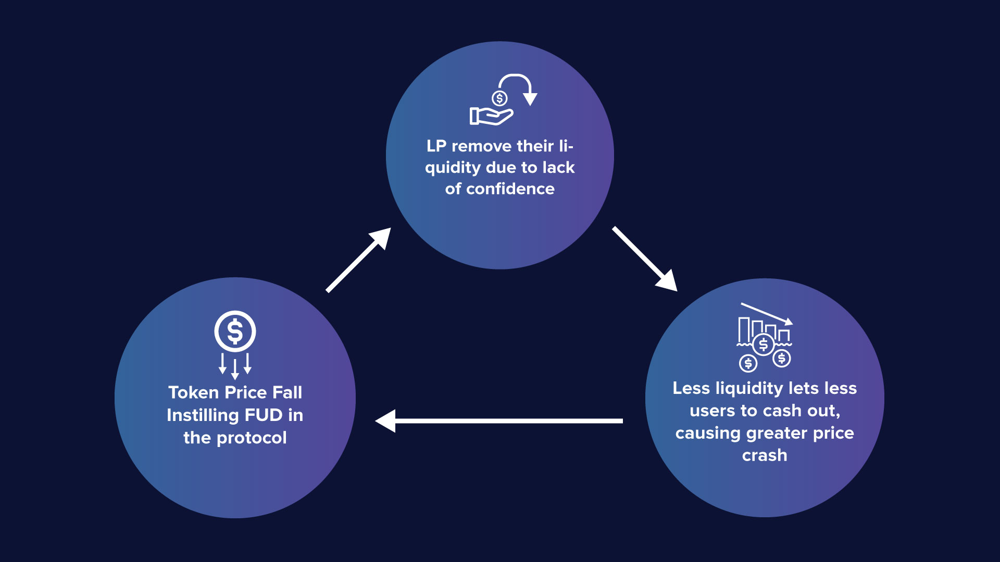

# Current Liquidity Landscape

In this day and age, it is a norm for projects to carve out a sizable portion of their token supply as a means to incentivize liquidity providers. The backlashes that come with this norm will harm the project’s sustainability in the following ways:

#### Sell Pressure&#x20;

Inflationary token emission is an immediate and short-term approach that carries increased sell pressure on farm tokens as a bi-product. Liquidity providers (LPs) who are there only for the gains will more often than not sell the rewards as the most direct means to compensate for the investment. Conventional solutions such as the likes of time-locked staking are not the most optimal because it still doesn’t relieve the core pain points but is just kicking the can down the road.

#### Miscoordination

Liquidity providers are driven not by belief in the project but are incentivized by the lucrative rates. Therefore, more often than not, when LP rewards reach the point of exhaustion, they will simply eject their capital for another opportunity with a different project.

#### Lack of ‘Buyer of Last Resort’&#x20;

In traditional banking, the central banks are usually lenders of last resort, when there is a financial meltdown and a bank needs funds immediately and has no other options for funding, they would turn to the central banks. In crypto, when the market is bad, liquidity providers would rush to exit their position and pull out their liquidity. However, these moments are usually those when the project needs liquidity the most for price stabilization. In addition, the high trading volume would incur higher trading fees for the liquidity providers.

#### IL for Liquidity Providers

A project’s success would often mean an increase of project token value, which would result in creating a scenario of impermanent loss for the LPs. This kind of miscoordination can prove to be disincentivizing long-term liquidity providers, even if they are there for the long haul. They might be reluctant to provide liquidity if they think that providing liquidity is not as profitable as holding the token.

