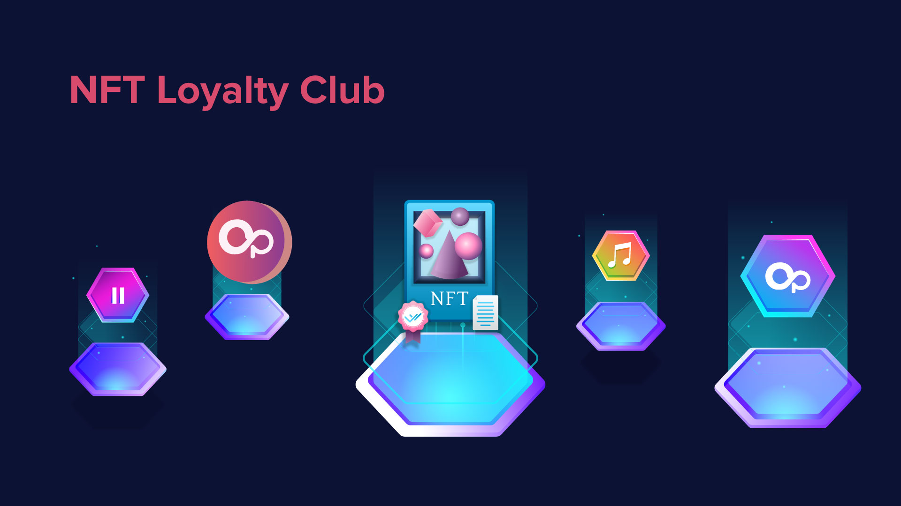

# NFT Loyalty Club

OpenSwap offers an innovative way for users to show their support and loyalty to their beloved projects through staking project tokens in the OpenSwap NFT Loyalty Club to mint unique NFTs that would represent the loyalty to the supported project. Projects may offer additional perks in the form of APR reward boost, community airdrops, periodic payouts, and customized NFT utilities, to ensure users and community members will continuously support them and their missions. Furthermore, these NFTs can be used in synergy with the project’s staking and farming campaigns held on OpenSwap, loyal project supporters who hold these project NFTs will get the maximized incentives.
