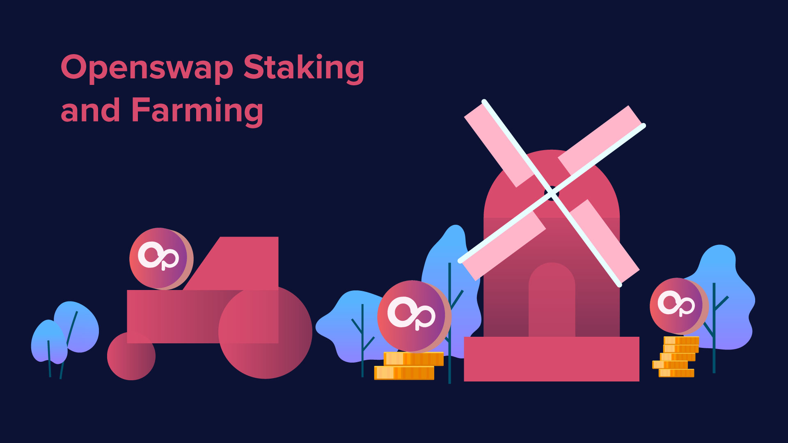

# Staking & Farming Program

OpenSwap offers multiple staking and farming opportunities to our users periodically. Community members can stake your LP tokens and earn OSWAP tokens in return. We will continuously incentivize many liquidity pairs by offering our liquidity providers the chance to stake their LP tokens in our farms. Upon the launch of OS Pro, users can also participate in projects-driven staking and farming programs where there will be an opportunity to swap LPs to receive discounted project tokens.
