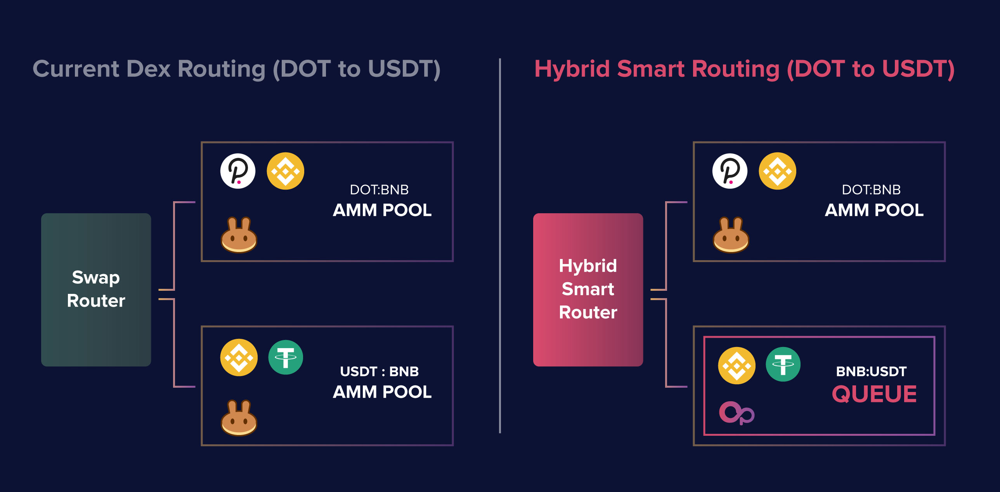

# Hybrid Smart Router

### AMM DEX Environment

The usage of AMM pools for DEX swaps had became the de facto way of swapping onchain. These onchain swaps heavily rely on liquidity provisioning by liquidity providers into AMM pools that are incentivized by activities like farming. Through simply reviewing the farming incentives offered to different pairs provides clues on what the market wants.

Swappers in this day and age want to be able to swap against stablecoins, however, such AMM pools are also the ones that would be subjected to the most impermanent loss and few liquidity providers are willing to fund such a pair. As such, majority of the chains will use their native token (i.e. BNB, AVAX, MATIC, FTM) as the main AMM pairing so there is a greater degree of correlation with the target tokens.

On Binance Smart Chain, this token is BNB - thus, on BSC DEXs, the usual top pairs are often BTC/WBNB, ETH/WBNB, CAKE/WBNB, and a key pair which is also funded is WBNB/BUSD, which is a key pair to enabling users to buy a token using a stablecoin.

The drawback is that such swaps would require 2 hops, which would incur doubling of the transaction fees. In most cases on Pancake, a 2-hop swap would incur a transaction fee of 0.5%, which can be quite significant for large size or frequent swappers.

### **How Does Hybrid Smart Router Work**

With the introduction of liquidity queue technology, market makers and market takers have a mechanism to carry out efficient spot market transactions on selected pairs, notably pairs involving stablecoins.

Currently, DEX routers only work with their own AMM pools. Thus, as the below diagram illustrates, a 2-hop swap on Pancake would incur a transaction fee of 0.5% in addition to price slippage on both pools.

OpenSwap’s Hybrid Smart Router can help take the liquidity queues to the next level, by enabling the coupling of swap trades from AMM pools with liquidity queues, which can provide a clear advantage over ‘AMM-only’ approaches.

Hybrid Smart Router is a set of smart contracts that identify potential swap paths leveraging both AMM pool and liquidity queue smart contracts. Based on the potential paths, it will be possible to identify the most cost-efficient routing based on the availability of liquidity queues and AMM pools. If no liquidity is required from the queues for the swap, then only AMM pool paths will be presented, and similarly if a single liquidity queue is all that is required to complete the swap, then only liquidity queue paths will be presented and used.

Since liquidity queues offer clear advantages on stablecoin pairs such as BNB/USDT, it is envisioned that OpenSwap Hybrid Smart Router will best demonstrate its ability when swaps based on stablecoins are requested. In such a scenario, whether a user wants to swap into a stable coin or out of one, the Hybrid Smart Router will set up a multi-hop swap leveraging both AMM pools and liquidity queues to provide the best possible and lowest possible options for the swapper.

### Integrating with Hybrid Smart Router

It is envisioned that OpenSwap Hybrid Smart Router will serve as one of the key gateway to liquidity queues and AMM pools, as such, OpenSwap will continuously work to integrate with additional wallets and aggregators through partnerships, as a means to extend the reach of onchain liquidity options.

