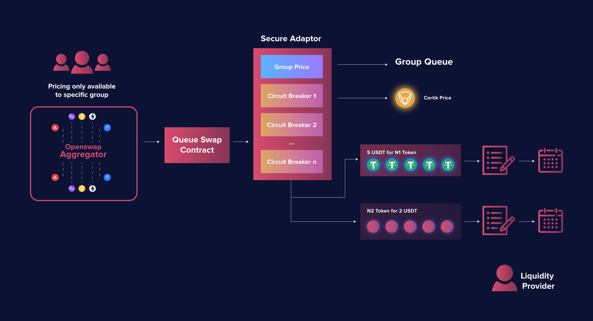

# Liquidity Queue

### **Liquidity Queue**&#x20;

OpenSwap’s liquidity queues is a new approach to onchain liquidity that offers traders and market makers a novel and efficient mechanism for carrying out onchain trades.

Onchain trades are growing exponentially since the introduction of Automated Market Maker (AMM) based DEXs due to the ease of listing new pairs and a straightforward pricing mechanism. However, all is not perfect with impermanent loss, lack of control for market makers and liquidity providers, and high transaction fees and price slippage for market takers.

At the core of all DEX swaps are the pricing mechanism. AMM DEX’s base pricing off of predefined constant product formulas (i.e. x\*y=k) and arbitrage traders are incentivized to trade off the pool to keep it pegged to market prices. Although such a mechanism will reflect market pricing, it will only work for small volume trades due to the inherent slippage in the mechanism.

As noted above, rather than simply refining AMM formulas for modest improvements, OpenSwap’s liquidity queue technology removes the one-size-fits-all approach of current DEXs. instead of a single pricing mechanism. OpenSwap believes that pricing should be based on individual use cases. As such, the liquidity queue base layer technologies can be shaped to create different queue types, with each queue type based on a different pricing mechanism.

### **Spot Price Queue**

Spot Price Queue will enable trades to occur at spot-market prices obtained from decentralized oracles. This queue type uses a secure adaptor protocol that guards against many of the shortcomings of using oracles. The secure adaptor protocol includes a series of customizable circuit breakers that ensure that liquidity providers are protected against front-running or recent security exploits as trades that fail any of the circuit breakers will not be carried out.

Spot Price Queue are designed for token pairs that have a well-established off-chain spot market price provided by oracles. Instead of using the oracles directly, OpenSwap has created a secure adaptor protocol to leverage oracle pricing in a controlled manner providing traders with the security of layered circuit breakers that guard against sudden price fluctuations, front-running, and compromised smart contracts.

The circuit breakers composes of but not limited to:

Trade Value: Individual trades will be capped at a certain value, i.e. $10,000 at the initial phase of feature release.

Secondary Pricing Variance: An additional reference price will be obtained from either another oracle source or exchange. If the oracle price exceeds a certain threshold (i.e. 1%) then the circuit break will not enable the trade.

The secure adaptor protocol allows for an unlimited number of circuit breakers to be added in, and it is also possible for circuit breakers to leverage data passed from the DApp. New adaptors can be voted into place via the governance portal to support new token pairs and to support new strategies for providing spot price trades.

There are currently two sub-types of Spot Price Queue:

**Spot Priority Queue**

A sub-type of Spot Price Queue is designed for traders seeking to exit out of a position quickly, and at spot market price. Priority can be achieved through staking OSWAP tokens. The order with the highest amount of OSWAP tokens staked will be sold first. Traders can also set an expiry date for their orders so that no more will be sold after a certain time (if not already sold).

#### Spot Range Queue

A sub-type of Spot Price Queue that will provide the ability for liquidity providers to set price brackets on which to make their liquidity available for sale. Trading DApps reading into the liquidity queues can initiate trades using the liquidity as long as the market price is within the range set by the liquidity provider. The transaction price will be based on the existing spot market price.

In both sub-types, liquidity providers joining the queues have the option of canceling or withdrawing their liquidity as long as it has not been swapped against yet.

### Restricted Group Queue

Restricted Group Queue is a type of liquidity queue that can enable liquidity providers to offer a token at a specific price that can only be accessed by a defined group of user addresses.

Based on the liquidity queue technology, Restricted Group Queue is designed with additional features and capabilities on the contract governing the liquidity queues. Similar to Spot Price Queue, each new pair on Restricted Group Queue would need to be voted into place through the governance portal. After the queue is voted into place, liquidity providers can define their own queues within the queue pair.

User can make use of OpenSwap Restricted Group Queues’ key features for their DeFi use cases:

#### Group Whitelisting:

Make liquidity only available for defined addresses to swap against.

#### Liquidity Allocation:

Trade size allocations can be defined for all or specific members of a group.

#### Defined Validity Period:

Enable liquidity to be only available for a defined duration.

#### Restricted Withdrawals:

An option to lock liquidity in Restricted Group Queue to demonstrate that the liquidity is committed and cannot be withdrawn unless there were no takers during the validity period.

These key features can open the door to many unique to DeFi and onchain use cases, including but not limited to:

#### Onchain Private Sale

Post-IDO projects who seek additional funding but do not want to suffer from project token price fluctuation can opt to temporarily sell a portion of their token allocation through OSPro’s onchain private sale offering powered by Restricted Group Queue.

#### Guarantee Token Buyback

New projects can use Restricted Group Queue to whitelist private sale, strategic round, or public round IDO participants along with a specific allocation to offer a token buyback for a specific period of time providing price assurance and boost investors’ confidence.

#### Special Group Trade Offers

Liquidity providers or traders may elect to offer certain assets at a specific price but only for a targeted group of counterparties. This can be done via Restricted Group Queue.

### Pegged Queue

Pegged Queue is another usage of the liquidity queue technology where users can enable digital assets to always be priced based on a fixed ratio to another asset.

Unlike the conventional practices where a stablecoin project would list and open up different AMM pools on various DEXs as a means to attract utilization and gain popularity, OpenSwap’s Pegged Queue can prove to be a more efficient solution for stablecoin project owners because this feature can:

* Facilitate the stablecoin to any token swaps with zero slippage and transactional fees
* Opens up the stablecoin to swapping with the maximum number of tokens
* Help the stablecoin maintain their target pegs through a stabilized environment and mechanism
* Offer the enablement of having the stablecoin to easily be partnered with other projects

In addition, OpenSwap will be introducing a new solution that will matchmake a combination of different liquidity queue types, and be armed with the Hybrid Smart Router, to create a bespoke and tailored solution for stablecoin projects.
