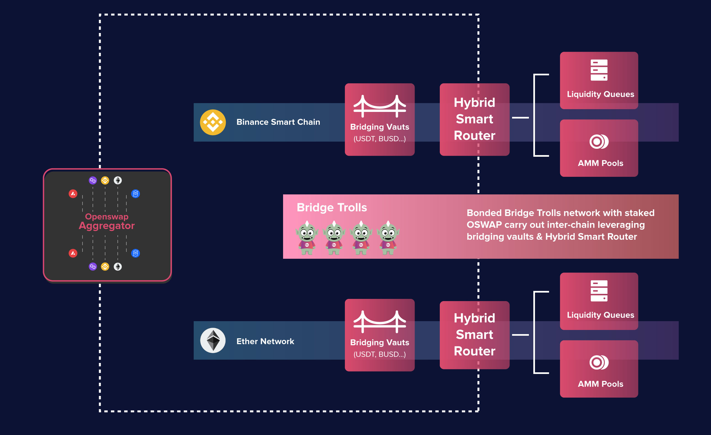
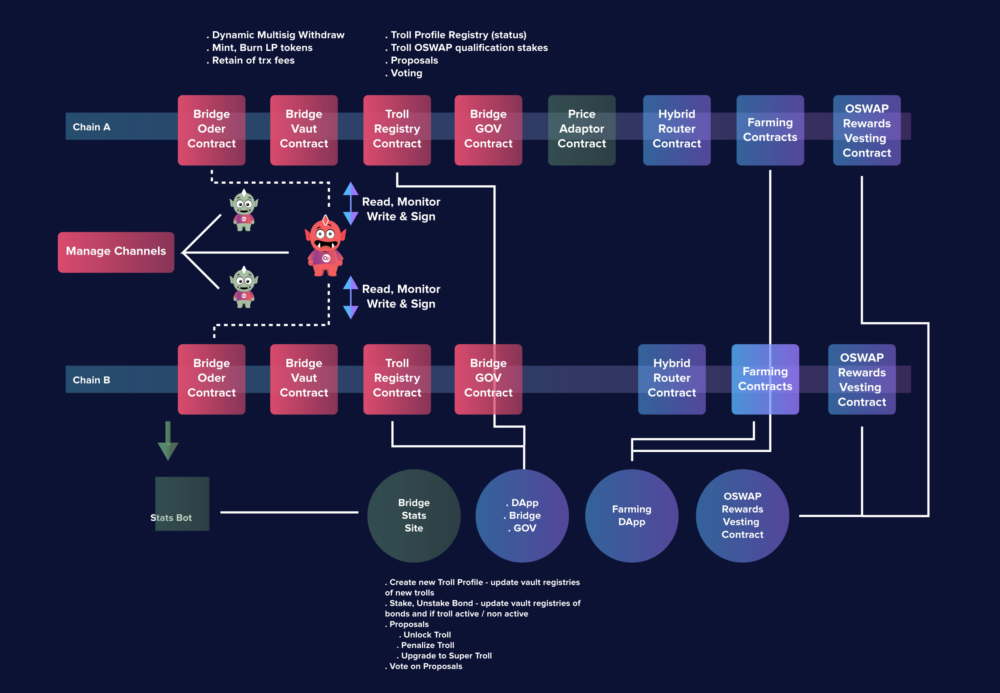
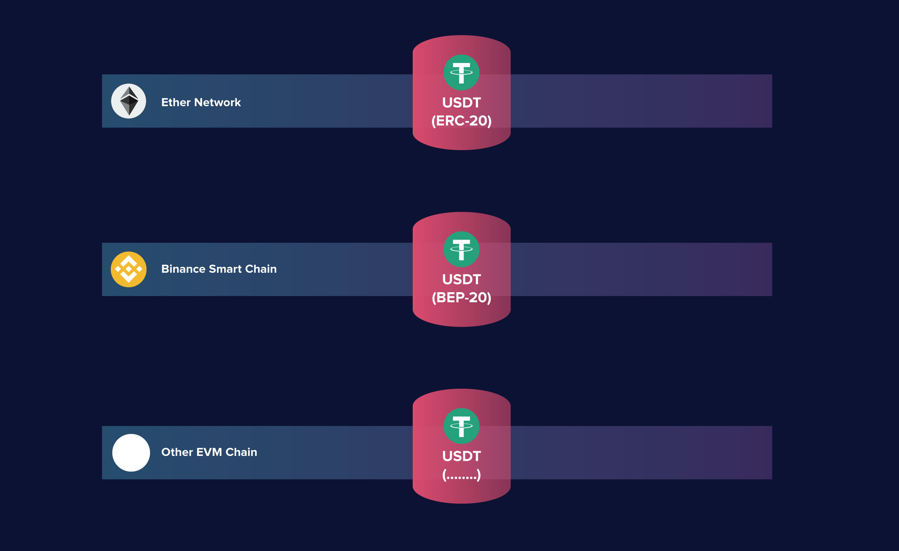
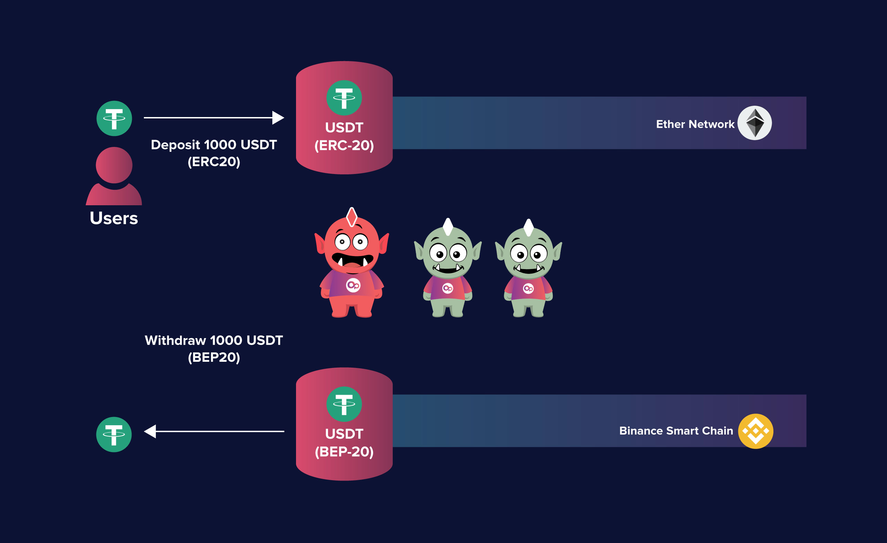

# Open Interchain Protocol

### Crosschain Environment

The goal of crosschain bridging and swapping is one of the longest ongoing topics of interest in the DeFi space. As we progress into the multichain landscape, the enablement of changing assets across different chains has become an important fundamental necessity. In the current crosschain environment, the most typical approaches that are being utilized are:

Lock and Mint Synthetics - A method used by the likes of Binance Bridge and Multichain (Anyswap), where native tokens are given to a centralized custodian who in turn mints a synthetic version of the token on a target blockchain. The decentralized version requires usage of decentralized custodians that are properly incentivized to behave appropriately. Majority of crosschain bridges are of the Lock and Mint variety, the difference mostly lies on how true decentralization is actually achieved, and also the bridge operators’ approach on key security.

Crosschain Liquidity Pair Pool - A method experimented and led by the likes of Throchain, whereby liquidity providers stake paris consisting of a native token with Thorchain’s RUNE token into pools, and Throchain routes swaps leveraging the common RUNE token to facilitate crosschain swaps. With this approach, swappers are able to receive native tokens on the target chain instead of synthetics.

While these conventional approaches are moderately acceptable in the current nascent stage market, there are still many critical issues that need to be addressed, such as slow in speed, expensive costs, high complexity, and the proliferation of synthetics of the same underlying assets.

### **How Does Open Interchain Protocol Work**

Open Interchain Protocol is introduced as a solution that offers more efficient crosschain swapping of chain-native assets through the usage of single asset vaults and a basket of decentralized mechanisms.

With the incorporation of other OpenSwap technologies like liquidity queue and hybrid smart router, Open Interchain Protocol will form a fully transparent and capital efficient end-to-end crosschain swapping solution.

Designed to be decentralized and easily extendable, Open Interchain Protocol along with all the key components can be quickly moved to additional EVM compatible chains through a simple deployment of the set of contracts onto the new chain. Initially, the protocol will support Binance Smart Chain and Ethereum, and will soon be followed by popular and trending EVM compatible chains such as Fantom, Polygon, and Avalanche.

The key concept that makes Open Interchain Protocol different and better than conventional crosschain bridging models is the use of Single Asset Vaults. These are vault smart contracts that exist on blockchains that are supported by OpenSwap. They enable liquidity providers the opportunity to put their digital assets to work without having to worry about impermanent loss. These vaults will be considered as 1:1 representatives of the bridge tokens on the different chains.

Enabling Open Interchain Protocol to release a corresponding amount of the target chain’s version of the token once the source chain’s tokens are confirmed to be successfully deposited.

A key feature of these smart contracts is the dynamic multisig feature that governs the release of funds. Funds can only be transferred out of a vault if it is signed by a multiplicity of bridge trolls. A set of rules governs how transactions are signed based on the size of a transaction. Essentially, the number of signers required will be proportional to the swap transaction size ensuring that bonded staked sufficiently cover the swap transactions so that malicious behavior can be mitigated. During the initial feature rollout, it is anticipated that the majority of the bridge vaults will be for stablecoins such as USDT, DAI, BUSD, and other native chain tokens such as BNB and ETH.
