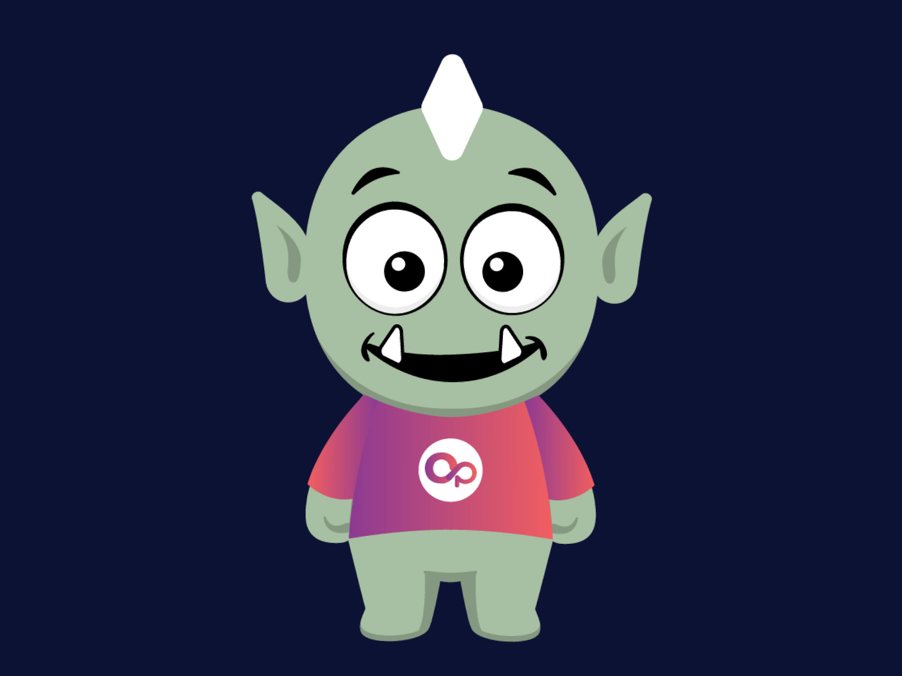
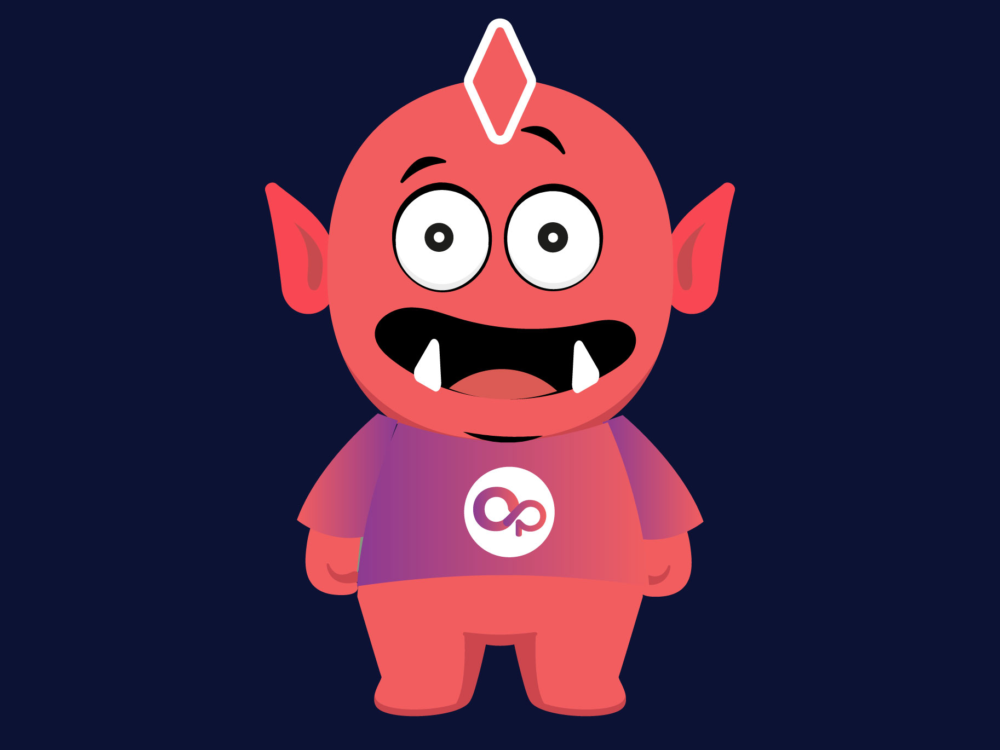

# Bridge Trolls

At its core, Open Interchain Protocol consists of a network of Bridge Trolls working together to facilitate bridging functions. Bridge Trolls serve a critical role as node validators who perform the tasks of monitoring the protocol for transaction requests, verifying, and signing transactions to carry out the withdrawal of funds on different blockchains. In order to ensure that Bridge Trolls behave appropriately, they need to stake a bond in the form of the native OSWAP tokens which are put at risk if they carry out any inappropriate actions. In return, Bridge Trolls will be compensated with a portion of the bridge fees (transaction fees) for carrying out the bridging activities.
There are two types of Bridge Trolls in the Open Interchain ecosystem:

 

#### Green Bridge Troll

Anyone who holds an OpenSwap Bridge Troll NFT can stake the NFT to the Green Troll. The NFTs activate the Green Bridge Troll as a validator in the ecosystem and in return, stakers receive a portion of the fees for each transaction validated by the Green Bridge Troll. By signing a bridge transaction, the Green Bridge Troll is indicating that it has validated the transaction. The number of Bridge Trolls involved in a particular transaction is dictated by Bridge Governance and is expected to increase as the network grows to maintain decentralization and strengthen the security of the network. 
Eventually, the OpenSwap Bridge Troll software will be available for anyone to install to become a Green Bridge Troll operator. However, an OpenSwap Bridge Troll NFT stake is required to activate it to participate in bridge activities.

#### Mean Bridge Troll

Mean Bridge Trolls are enhanced versions of Green Bridge Trolls with additional responsibilities to monitor, validate, and execute on-chain transactions. This means that operators must fund the Mean Bridge Trolls to pay for the gas to execute transactions on the various chains. 
In addition to executing transactions, Mean Bridge Trolls also participate in Bridge Governance to update configurations for the network. With these additional responsibilities, Mean Bridge Trolls are eligible to receive a larger portion of the bridge fees.
Mean Bridge Trolls have additional requirements including a bond that is staked on each chain to cover the transaction sizes it may support. It must also be voted into the network by the existing Mean Bridge Trolls. Any inappropriate behavior will be penalized by slashing the bond and being kicked out of the Bridge Troll network.