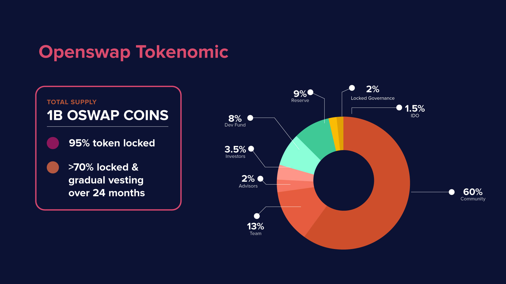

# 💰 Tokenomics

OSWAP token is the governance token of the OpenSwap ecosystem. The core purposes of OSWAP token are to:

* Incentivize usage of the OpenSwap platform
* Encourage users to get involved in governance
* Enable a wide variety of platform privileges surrounding core technologies and ecosystem offerings

Listed below are some of OSWAP token's generic utilities surrounding core technologies and ecosystem offerings. We will continue to update this section as the project develops.

#### **Open Interchain Protocol**

*   Crosschain Bridge Fees

    **U**pon feature release, users who utilize Open Interchain Protocol as their crosschain solution will need OSWAP tokens as transaction fees for the crosschain activities.
*   Node Validators

    Bridge Troll NFT holders who wishes to become node validators (Bridge Trolls) for Open Interchain Protocol will need to stake OSWAP token as bond.

#### Liquidity Queue

* **Priority Queue**\
  ****Liquidity Providers who wants to set up a Priority Queue will need OSWAP tokens for the setup fees.
* **Range Queue**\
  ****Liquidity Providers who wants to set up a Range Queue will need OSWAP tokens for the setup fees.
* **Group Queue**\
  ****Users who wants to set up a Group Queue will need OSWAP tokens for the setup fees.
* **Booster Queue**\
  ****Project Owners who wants to set up a Booster Queue will need OSWAP tokens for setup fees.
* **Buyback Queue**\
  ****Project Owners who wants to set up a Buyback Queue will need OSWAP tokens for setup fees.

#### NFT Loyalty Program

* **Troll Camp**\
  ****Users who wants to participate in NFT Loyalty Program such as Troll Camp, will need OSWAP tokens for staking.

#### **Staking and Farming**

* **Fixed Staking Rewards**\
  ****Users who wants to participate in Fixed Staking Rewards programs will need OSWAP for staking.
* **Troll Farms**\
  ****Users who wants to participate in Farming programs such as Troll Farms will need OSWAP for LP token creation.

OSWAP token was established as an ERC20 token, and was bridged to Binance Smart Chain (BSC) to enable the governance of the BSC version of OpenSwap during the initial launch. OSWAP tokens have no financial value.

OpenSwap has designed its tokenomics to support a sustainable long-term project ensuring that:

* 95% of all tokens will be subjected to locking and gradual vesting schedules
* Over 70% of all tokens will be subjected to vesting schedules of over 24 months
* Core team allocations and related tokens are subjected to long-term vesting periods to ensure community member confidence

#### OS Pro

Project Owners will need OSWAP tokens for access to OS Pro offerings upon feature release. Further information on exact OSWAP token utility for this category will be elaborated closer to feature release date.

OSWAP token is an ERC20 token with a 1B hard-capped total token supply. OSWAP tokens was bridged to BSC during the initial rollout, and will continuously be bridged to other chains as the OpenSwap project matures and develops.
